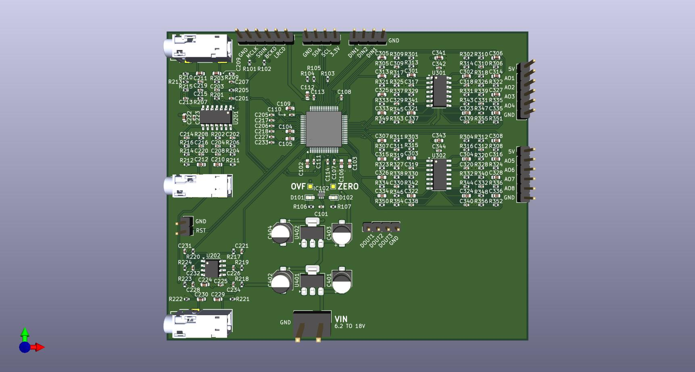
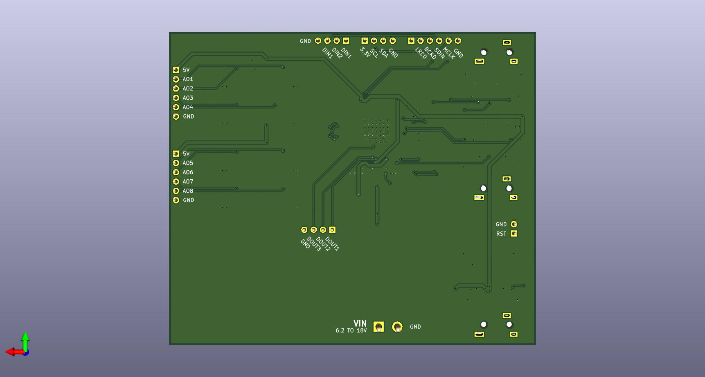

# PCM3168APAP Breakout Board

A breakout board for the Texas Instruments PCM3168APAP audio codec, featuring 6 analog inputs and 8 analog outputs with high-quality buffering and filtering circuitry.
| PCB Front | PCB Back |
|-----------|----------|
|  |  |

## Overview

This evaluation board is based on the TI TIDA-00609 reference design and provides a complete interface to the PCM3168APAP - a 24-bit, 96kHz/192kHz, 6-in/8-out audio codec. The board includes analog input buffering with anti-aliasing filters, differential-to-single-ended output conversion, and integrated power regulation.

## Features

### Audio Codec
- **ADC**: 6-channel, 24-bit delta-sigma ADC with 107 dB dynamic range (differential), 104 dB (single-ended)
- **DAC**: 8-channel, 24-bit delta-sigma DAC with 112 dB dynamic range and differential 8V peak-to-peak outputs
- Sampling rates: 8 kHz to 192 kHz (ADC up to 96 kHz, DAC up to 192 kHz)
- Supports I²S, left-justified, right-justified, DSP, and TDM audio formats

### Analog Signal Path

#### Inputs (6 channels)
- 3.5mm TRS jack connectors for each stereo input pair
- Buffer and anti-aliasing low-pass filter based on OPA4134/OPA2134 op-amps
- Configured for 2V RMS input, 0.5x gain, -3dB at 48 kHz 
- Output: 1V RMS to ADC
- Common-mode reference voltage (VCOMAD) generation

#### Outputs (8 channels)
- Two 6-pin headers providing 4 channels each
- Post-LPF and differential-to-single-ended conversion using OPA4134 op-amps
- Configured for 4V peak-to-peak DAC output, 0.747x gain, -3dB at 53 kHz
- Output: 2V RMS single-ended

### Digital Interface
- **I²S/Audio** (6-pin header): MCLK, BCK_ADC, LRCK_ADC, BCK_DAC, LRCK_DAC, and ground
- **I²C** (4-pin header): SDA, SCL, 3.3V, and ground
- **Digital Input** (4-pin header): DIN2, DIN3, SDIN (DIN1), and ground
- **Digital Output** (4-pin header): DOUT1, DOUT2, DOUT3, and ground
- **Reset** (2-pin header): Active-low reset with buffer IC (SN74LVC2G34)

### Configuration
- I²C mode (MODE pin tied to GND)
- I²C device address: 0x88
- Test points for ZERO and OVERFLOW flags
- Status LEDs: Green (ZERO), Yellow (OVERFLOW)

### Power Supply
- Input voltage: 6.2V to 18V
- Dual linear regulators (AMS1117):
  - 5V output for analog circuitry
  - 3.3V output for digital logic
- Comprehensive decoupling throughout

## Bill of Materials Highlights

### Key Components
- **IC101**: PCM3168APAP (HTQFP-64 package)
- **IC102**: SN74LVC2G34DRLR (dual buffer for reset/LEDs)
- **U201-U202, U301-U302**: OPA4134UA/OPA2134 (audio op-amps)
- **U401-U402**: AMS1117-5.0 and AMS1117-3.3 (linear regulators)

### Connectors
- J101: 6-pin I²S header
- J102: 4-pin I²C header
- J103-J104: 4-pin DIN/DOUT headers
- J201-J203: 3.5mm TRS analog input jacks
- J301-J302: 6-pin analog output headers
- J401: 2-pin power input

## Usage Notes

- Ensure proper power supply voltage range (6.2V minimum to avoid dropout on regulators) 
- The board is configured for I²C control by default
- All analog inputs accept balanced TRS connections or can be used with unbalanced sources
- Output headers provide differential pairs that have been converted to single-ended signals 

## License

[MIT License](./LICENSE)

## Revision History

- **v0.1** (2026-01-13): Initial release

